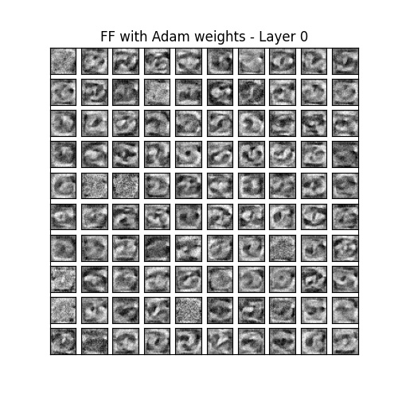

[![MIT License][license-shield]][license-url]

<br>
<p align="center">
  <h1 align="center">DL Dojo</h1>

  <p align="center">
   My happy place to play around reimplementing the basic building blocks of deep learning with nothing fancier than Numpy.
</p>

## Includes: 

[x] Gradient checking

[x] Batch Normalization

[x] Dropout

[x] L1 Regularization

[x] All main activations (ReLU, Leaky ReLU, Linear, Sigmoid, Softmax)

[x] A bunch of initializers (normal, uniform, ones, zers, Glorot Normal/Uniform, He Normal/Uniform)

[x] A bunch of optimizers (SGD, Momentum, Nesterov Momentum, Adagrad, RMSProp, Adam)

[x] MSE, Binary Cross Entropy and Categorical Cross Entropy losses

[x] MNIST prediction

[x] Weight plotting

## TODO and WIP:

[ ] Conv2D, DeConv and Pooling layers

[ ] RNN, LSTM and everything recurrent

[ ] Self-attention layer

*Is this the best possible way of implementing a neural network library?* Definitely not

*Couldn't you think of a better way of doing this?* Yes, absolutely

*Is this thing bug-free?* Probably not, it's still very much WIP

*Why didn't you do X instead?* Either I didn't have the time, or I didn't think about it, or I didn't feel like it, or a mix of the three :) 

*Why didn't you implement a full autodiff library with computational graphs instead?* Because I started implementing stuff and kept going until I felt like it, and then I didn't feel like refactoring the whole project. But I'd love to do it at some point in the future, if I ever have the time

*So, what's the point of this project?* Well, I learned a lot reimplementing all these things from scratch, and I had a lot of fun 

*Does it really work?* Yes, it does!

Here's some of the things it can do...

<p align="center">
Classifying MNIST digits
<br>

<br>

<p align="center">
Generating MNIST digits from a trained autoencoder
<br>

<br>

<p align="center">
Visualising weights of a trained net
<br>

<br>

<br>

*How do I run it?* 

Install the dependencies with:
```sh
pip install -r requirements.txt
```

There's only 3 of them: matplotlib, tqdm and numpy.

There's a bunch of test functions in main.py - just comment out the ones you don't want to run, then run main.py

```sh
cd src && python main.py
```

[license-shield]: https://img.shields.io/github/license/othneildrew/Best-README-Template.svg?style=flat-square
[license-url]: https://github.com/othneildrew/Best-README-Template/blob/master/LICENSE.txt